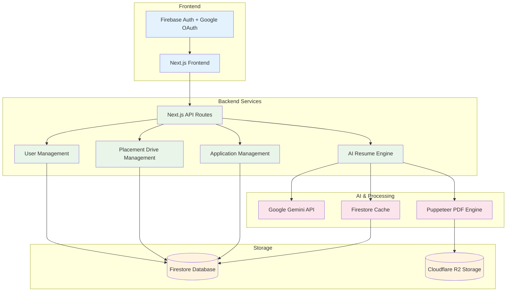

# 🏗️ Placecraft Technical Architecture

> **Overview:** This document describes the technical architecture of Placecraft, an AI-powered placement management platform built with Next.js, Firebase, and Google Gemini AI.

---

## 📊 Architecture Diagram



---

## 🔧 Technical Components

### Frontend Layer
| Component | Technology | Purpose |
|-----------|-----------|---------|
| **Next.js Frontend** | Next.js 16 + React 19 | Server-side rendered web application with App Router |
| **Authentication** | Firebase Auth + Google OAuth 2.0 | Secure user authentication and session management |
| **State Management** | Zustand | Lightweight state management for client-side data |
| **UI Components** | Radix UI + TailwindCSS v4 | Accessible, customizable component library |

### Backend Services Layer
| Component | Technology | Purpose |
|-----------|-----------|---------|
| **API Routes** | Next.js API Routes | Serverless API endpoints for all operations |
| **AI Resume Engine** | Custom TypeScript + Gemini | Resume parsing, scoring, and generation logic |
| **User Management** | Firestore + Firebase Auth | Student, admin, and recruiter profile management |
| **Placement Drive Management** | Firestore | Drive creation, eligibility rules, and workflow |
| **Application Management** | Firestore | Job application tracking and status updates |

### AI & Processing Layer
| Component | Technology | Purpose |
|-----------|-----------|---------|
| **Google Gemini API** | Gemini 2.5 Flash | AI model for resume analysis and content generation |
| **Firestore Cache** | Firestore Collection | Caches AI responses to reduce API calls and costs |
| **Puppeteer PDF Engine** | Puppeteer | Server-side PDF generation for resumes |

### Storage Layer
| Component | Technology | Purpose |
|-----------|-----------|---------|
| **Firestore Database** | Google Cloud Firestore | NoSQL database for user data, applications, and cache |
| **Cloudflare R2** | S3-compatible object storage | Secure file storage for resume uploads |

---

## 🔄 Data Flow

### 1. User Authentication Flow
```
User → Google OAuth → Firebase Auth → Session Token → Protected Routes
```

### 2. Resume Upload & Analysis Flow
```
Student uploads PDF → R2 Storage → Extract text (pdf2json/Gemini) 
→ Analyze with Gemini AI → Cache results in Firestore → Return scores & suggestions
```

### 3. Resume Generation Flow
```
Student profile data → AI Resume Engine → Generate sections via Gemini 
→ Cache responses → Puppeteer PDF generation → Upload to R2 → Return download URL
```

### 4. Application Workflow
```
Student applies → Lock resume version → Store in Firestore 
→ Recruiter views → Shortlist/Reject → Update status → Notify student
```

---

## 🎯 Key Design Decisions

### Why Next.js?
- **Server-side rendering** for better SEO and performance
- **API Routes** eliminate need for separate backend server
- **App Router** provides modern routing and layouts
- **Built-in optimization** for images, fonts, and scripts

### Why Firestore?
- **Real-time updates** for application status changes
- **Flexible schema** for evolving data models
- **Built-in security rules** for role-based access
- **Offline support** for better UX
- **Cost-effective** for read-heavy workloads with caching

### Why Cloudflare R2?
- **S3-compatible** API for easy integration
- **No egress fees** unlike AWS S3
- **Global CDN** for fast file access
- **Cost-effective** for file storage

### Why Gemini AI?
- **Free tier** with generous limits (15 RPM, 1500 RPD)
- **Multimodal** support for PDF processing
- **Fast response times** with Flash model
- **High-quality** text generation and analysis

### Caching Strategy
- **AI responses cached** in Firestore to reduce API costs
- **Cache key** based on input hash for consistency
- **Hit tracking** to monitor cache effectiveness
- **Expiration** support for time-sensitive data

---

## 🔐 Security Architecture

### Authentication & Authorization
- **Firebase Auth** handles user authentication
- **Role-based access control** enforced in Firestore rules
- **Server-side validation** for all API requests
- **Session tokens** for secure communication

### Data Security
- **Firestore security rules** prevent unauthorized access
- **API keys** stored in environment variables only
- **Signed URLs** for temporary file access
- **Input validation** on all user inputs

### File Security
- **Resume files** stored in private R2 bucket
- **Access via signed URLs** with expiration
- **Student-specific folders** for organization
- **Metadata tracking** for audit trails

---

## ⚡ Performance Optimizations

### Frontend
- **Server-side rendering** for initial page load
- **Code splitting** for smaller bundle sizes
- **Image optimization** with Next.js Image component
- **Lazy loading** for non-critical components

### Backend
- **AI response caching** reduces API calls by ~70%
- **Local PDF parsing** (pdf2json) before Gemini fallback
- **Rate limiting** to stay within free tier limits
- **Batch operations** for Firestore queries

### Storage
- **CDN delivery** via Cloudflare R2
- **Compressed file storage** for smaller sizes
- **Indexed queries** for fast data retrieval

---

## 📈 Scalability Considerations

### Current Capacity
- **Firestore:** 1M document reads/day (free tier)
- **Gemini AI:** 1,500 requests/day (free tier)
- **R2 Storage:** 10GB storage (free tier)
- **Next.js:** Scales automatically on Vercel

### Scaling Strategy
- **Horizontal scaling** via serverless architecture
- **Caching** reduces database and AI API load
- **Paid tiers** available for all services when needed
- **Multi-region** deployment possible with Cloudflare

---

## 🛠️ Technology Stack Summary

| Layer | Technologies |
|-------|-------------|
| **Frontend** | Next.js 16, React 19, TypeScript, TailwindCSS v4, Radix UI, Zustand |
| **Backend** | Next.js API Routes, Firebase Auth, Firestore |
| **AI/ML** | Google Gemini 2.5 Flash, pdf2json |
| **Storage** | Cloudflare R2, Firestore |
| **PDF** | Puppeteer |
| **Deployment** | Vercel (recommended), Netlify, Railway |

---

## 📚 Related Documentation

- [README.md](./README.md) - Setup and installation guide
- [PRD.md](./PRD.md) - Product requirements and features
- [firestore.rules](./firestore.rules) - Database security rules
- [firestore.indexes.json](./firestore.indexes.json) - Database indexes

---

**Last Updated:** January 2026  
**Version:** 1.0
