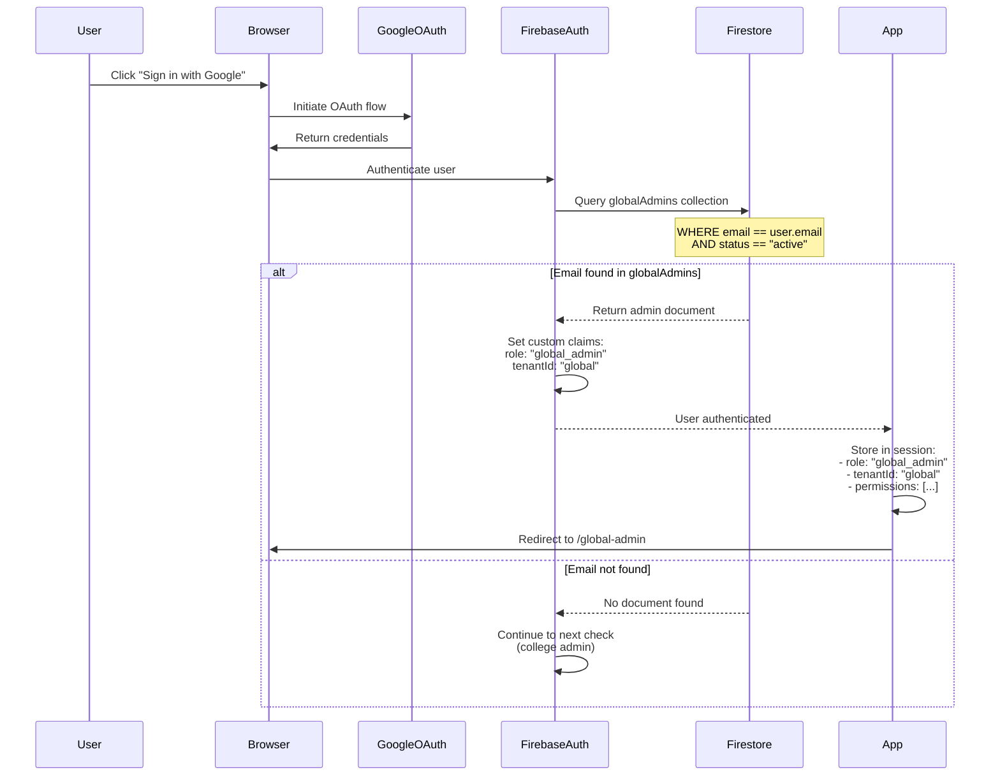
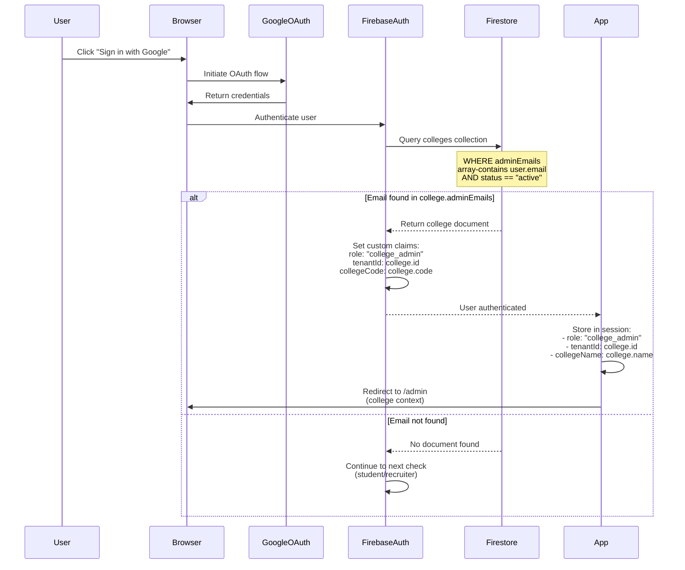
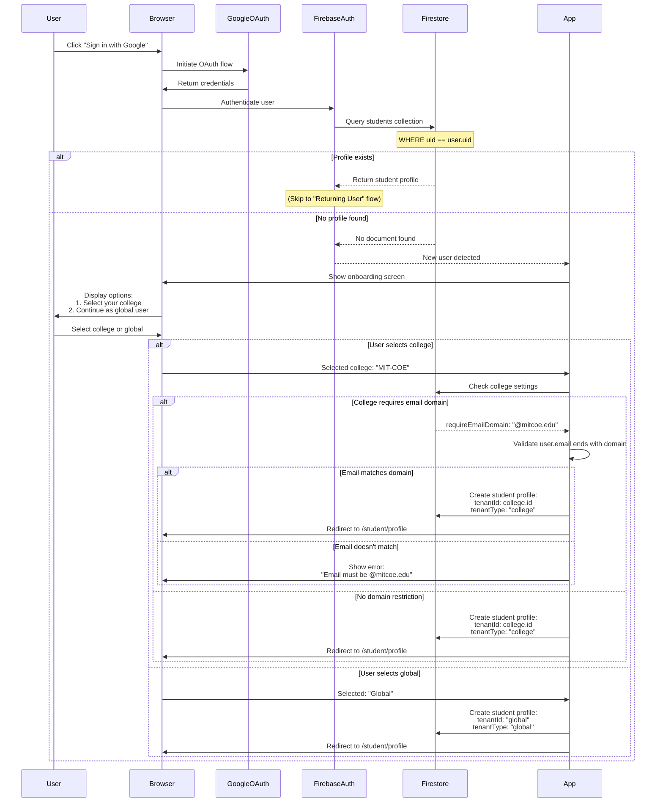
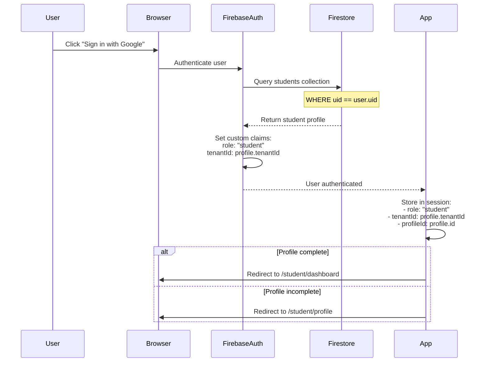
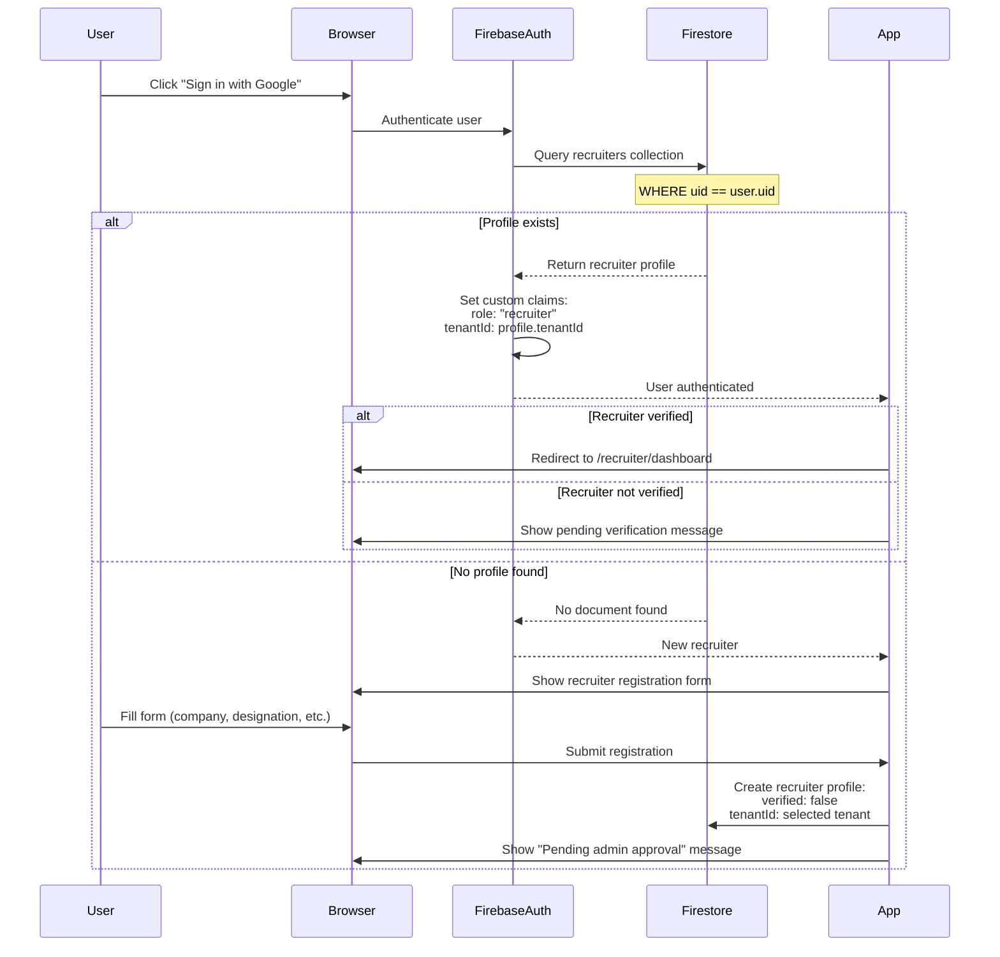

# 🔐 Authentication Flow - Multi-Tenant System

> **Feature:** Multi-Tenant Authentication & Authorization  
> **Version:** 2.0  
> **Last Updated:** January 2026

---

## 📋 Table of Contents

1. [Authentication Overview](#-authentication-overview)
2. [Login Flows](#-login-flows)
3. [Tenant Resolution](#-tenant-resolution)
4. [Authorization Checks](#-authorization-checks)
5. [Implementation Details](#-implementation-details)
6. [Code Examples](#-code-examples)

---

## 🎯 Authentication Overview

### Current System (Single Tenant)

```
User → Google OAuth → Firebase Auth → Check email in constants.ts → Assign role → Redirect
```

**Issues:**
- Hardcoded admin emails in `constants.ts`
- No tenant context
- Single admin type
- No college management

---

### New System (Multi-Tenant)

```
User → Google OAuth → Firebase Auth → Tenant Resolution → Role Assignment → Authorization → Redirect
```

**Improvements:**
- Dynamic admin management via Firestore
- Tenant context for all users
- Hierarchical admin system (global + college)
- College-based data isolation

---

## 🔑 Login Flows

### 1. Global Admin Login

**Scenario:** Super admin managing the entire platform



**Key Points:**
- Global admins have `tenantId: "global"` but can access all tenants
- Custom claims set in Firebase token for server-side validation
- Redirect to dedicated global admin dashboard

---

### 2. College Admin Login

**Scenario:** College placement officer managing their institution



**Key Points:**
- College admins are scoped to their specific college (`tenantId: college.id`)
- Same `/admin` route as before, but with college context
- Can manage only their college's students, drives, and recruiters

---

### 3. Student Login (First Time)

**Scenario:** New student signing up



**Key Points:**
- First-time users must choose college or global context
- College email domain validation (if configured)
- `tenantId` is permanent once set (cannot change later)

---

### 4. Student Login (Returning User)

**Scenario:** Existing student logging in



**Key Points:**
- Tenant context loaded from existing profile
- No onboarding needed
- Redirect based on profile completion status

---

### 5. Recruiter Login

**Scenario:** Recruiter accessing the platform



**Key Points:**
- Recruiters can be college-specific or global
- Require admin verification before posting drives
- Similar onboarding to students (choose college or global)

---

## 🎯 Tenant Resolution

### Resolution Logic

```typescript
async function resolveTenantContext(user: User): Promise<TenantContext> {
  // 1. Check if global admin
  const globalAdmin = await isGlobalAdmin(user.email);
  if (globalAdmin) {
    return {
      role: "global_admin",
      tenantId: "global",
      tenantType: "global",
      canAccessAllTenants: true
    };
  }
  
  // 2. Check if college admin
  const college = await getCollegeForAdmin(user.email);
  if (college) {
    return {
      role: "college_admin",
      tenantId: college.id,
      tenantType: "college",
      collegeId: college.id,
      collegeName: college.name,
      canAccessAllTenants: false
    };
  }
  
  // 3. Check existing student profile
  const student = await getStudentByUid(user.uid);
  if (student) {
    return {
      role: "student",
      tenantId: student.tenantId,
      tenantType: student.tenantType,
      collegeId: student.collegeId,
      profileId: student.id,
      canAccessAllTenants: false
    };
  }
  
  // 4. Check existing recruiter profile
  const recruiter = await getRecruiterByUid(user.uid);
  if (recruiter) {
    return {
      role: "recruiter",
      tenantId: recruiter.tenantId,
      tenantType: recruiter.tenantType,
      collegeId: recruiter.collegeId,
      profileId: recruiter.id,
      verified: recruiter.verified,
      canAccessAllTenants: false
    };
  }
  
  // 5. New user - needs onboarding
  return {
    role: null,
    tenantId: null,
    tenantType: null,
    needsOnboarding: true,
    canAccessAllTenants: false
  };
}
```

---

## 🔒 Authorization Checks

### Role-Based Access Control (RBAC)

| Route | Global Admin | College Admin | Student | Recruiter |
|-------|--------------|---------------|---------|-----------|
| `/global-admin/*` | ✅ | ❌ | ❌ | ❌ |
| `/admin/*` | ✅ (all colleges) | ✅ (own college) | ❌ | ❌ |
| `/student/*` | ✅ | ✅ (own college) | ✅ (own data) | ❌ |
| `/recruiter/*` | ✅ | ✅ (own college) | ❌ | ✅ (own data) |

---

### Tenant-Based Access Control

```typescript
function canAccessResource(
  user: TenantContext,
  resource: { tenantId: string }
): boolean {
  // Global admins can access everything
  if (user.canAccessAllTenants) {
    return true;
  }
  
  // Users can only access resources in their tenant
  return user.tenantId === resource.tenantId;
}
```

---

### Middleware Implementation

```typescript
// Next.js middleware for route protection
export async function middleware(request: NextRequest) {
  const user = await getAuthUser(request);
  
  if (!user) {
    return NextResponse.redirect(new URL('/login', request.url));
  }
  
  const tenantContext = await resolveTenantContext(user);
  
  // Global admin routes
  if (request.nextUrl.pathname.startsWith('/global-admin')) {
    if (tenantContext.role !== 'global_admin') {
      return NextResponse.redirect(new URL('/unauthorized', request.url));
    }
  }
  
  // College admin routes
  if (request.nextUrl.pathname.startsWith('/admin')) {
    if (!['global_admin', 'college_admin'].includes(tenantContext.role)) {
      return NextResponse.redirect(new URL('/unauthorized', request.url));
    }
  }
  
  // Student routes
  if (request.nextUrl.pathname.startsWith('/student')) {
    if (tenantContext.role !== 'student' && !tenantContext.canAccessAllTenants) {
      return NextResponse.redirect(new URL('/unauthorized', request.url));
    }
  }
  
  // Add tenant context to request headers
  const response = NextResponse.next();
  response.headers.set('x-tenant-id', tenantContext.tenantId || '');
  response.headers.set('x-user-role', tenantContext.role || '');
  
  return response;
}
```

---

## 💻 Implementation Details

### 1. Update `lib/firebase/auth.ts`

**Current:**
```typescript
export const getUserRole = (email: string | null): UserRole => {
  if (!email) return null;
  if (ALLOWED_ADMIN_EMAILS.includes(email)) return "admin";
  if (ALLOWED_RECRUITER_EMAILS.includes(email)) return "recruiter";
  return "student";
};
```

**New:**
```typescript
export const getUserRole = async (
  email: string | null,
  uid: string
): Promise<UserRole> => {
  if (!email) return null;
  
  // Check global admin
  const isGlobalAdmin = await checkGlobalAdmin(email);
  if (isGlobalAdmin) return "global_admin";
  
  // Check college admin
  const college = await getCollegeForAdmin(email);
  if (college) return "college_admin";
  
  // Check existing profile
  const student = await getStudentByUid(uid);
  if (student) return "student";
  
  const recruiter = await getRecruiterByUid(uid);
  if (recruiter) return "recruiter";
  
  // New user
  return null;
};
```

---

### 2. Create `lib/firebase/tenant.ts`

```typescript
import { collection, query, where, getDocs, limit } from "firebase/firestore";
import { getDb } from "./config";

export interface TenantContext {
  role: "global_admin" | "college_admin" | "student" | "recruiter" | null;
  tenantId: string | null;
  tenantType: "college" | "global" | null;
  collegeId?: string;
  collegeName?: string;
  collegeCode?: string;
  profileId?: string;
  verified?: boolean;
  canAccessAllTenants: boolean;
  needsOnboarding?: boolean;
}

export async function isGlobalAdmin(email: string): Promise<boolean> {
  const adminsRef = collection(getDb(), "globalAdmins");
  const q = query(
    adminsRef,
    where("email", "==", email),
    where("status", "==", "active"),
    limit(1)
  );
  const snapshot = await getDocs(q);
  return !snapshot.empty;
}

export async function getCollegeForAdmin(email: string): Promise<any | null> {
  const collegesRef = collection(getDb(), "colleges");
  const q = query(
    collegesRef,
    where("adminEmails", "array-contains", email),
    where("status", "==", "active"),
    limit(1)
  );
  const snapshot = await getDocs(q);
  
  if (snapshot.empty) return null;
  return { id: snapshot.docs[0].id, ...snapshot.docs[0].data() };
}

export async function resolveTenantContext(
  user: { uid: string; email: string | null }
): Promise<TenantContext> {
  if (!user.email) {
    return {
      role: null,
      tenantId: null,
      tenantType: null,
      canAccessAllTenants: false,
      needsOnboarding: true
    };
  }
  
  // Check global admin
  const globalAdmin = await isGlobalAdmin(user.email);
  if (globalAdmin) {
    return {
      role: "global_admin",
      tenantId: "global",
      tenantType: "global",
      canAccessAllTenants: true
    };
  }
  
  // Check college admin
  const college = await getCollegeForAdmin(user.email);
  if (college) {
    return {
      role: "college_admin",
      tenantId: college.id,
      tenantType: "college",
      collegeId: college.id,
      collegeName: college.name,
      collegeCode: college.code,
      canAccessAllTenants: false
    };
  }
  
  // Check student profile
  const student = await getStudentByUid(user.uid);
  if (student) {
    return {
      role: "student",
      tenantId: student.tenantId,
      tenantType: student.tenantType,
      collegeId: student.collegeId,
      collegeName: student.collegeName,
      profileId: student.id,
      canAccessAllTenants: false
    };
  }
  
  // Check recruiter profile
  const recruiter = await getRecruiterByUid(user.uid);
  if (recruiter) {
    return {
      role: "recruiter",
      tenantId: recruiter.tenantId,
      tenantType: recruiter.tenantType,
      collegeId: recruiter.collegeId,
      profileId: recruiter.id,
      verified: recruiter.verified,
      canAccessAllTenants: false
    };
  }
  
  // New user
  return {
    role: null,
    tenantId: null,
    tenantType: null,
    canAccessAllTenants: false,
    needsOnboarding: true
  };
}
```

---

### 3. Update `hooks/use-auth.ts`

```typescript
export function useAuth() {
  const [user, setUser] = useState<AuthUser | null>(null);
  const [loading, setLoading] = useState(true);
  const [tenantContext, setTenantContext] = useState<TenantContext | null>(null);
  const [profile, setProfile] = useState<StudentProfile | RecruiterProfile | null>(null);

  useEffect(() => {
    const unsubscribe = onTokenChange(async (firebaseUser: User | null) => {
      if (firebaseUser) {
        const authUser: AuthUser = {
          uid: firebaseUser.uid,
          email: firebaseUser.email,
          displayName: firebaseUser.displayName,
          photoURL: firebaseUser.photoURL,
        };
        setUser(authUser);
        
        // Resolve tenant context
        const context = await resolveTenantContext(firebaseUser);
        setTenantContext(context);
        
        // Load profile if applicable
        if (context.role === "student" && context.profileId) {
          const studentProfile = await getStudentById(context.profileId);
          setProfile(studentProfile);
        } else if (context.role === "recruiter" && context.profileId) {
          const recruiterProfile = await getRecruiterById(context.profileId);
          setProfile(recruiterProfile);
        }
        
        // Set session cookie
        const idToken = await firebaseUser.getIdToken();
        setSessionCookie(idToken);
      } else {
        setUser(null);
        setTenantContext(null);
        setProfile(null);
        clearSessionCookie();
      }
      setLoading(false);
    });

    return () => unsubscribe();
  }, []);

  return { user, loading, tenantContext, profile };
}
```

---

## 🧪 Testing Scenarios

### Test Case 1: Global Admin Login
- **Email:** `admin@placecraft.com` (in globalAdmins collection)
- **Expected:** Redirect to `/global-admin`, can access all colleges

### Test Case 2: College Admin Login
- **Email:** `placement@mitcoe.edu` (in college.adminEmails)
- **Expected:** Redirect to `/admin`, scoped to MIT-COE college

### Test Case 3: New Student (College)
- **Email:** `student@mitcoe.edu`
- **Expected:** Show onboarding, select MIT-COE, create profile with `tenantId: college_id`

### Test Case 4: New Student (Global)
- **Email:** `freelancer@gmail.com`
- **Expected:** Show onboarding, select "Global", create profile with `tenantId: "global"`

### Test Case 5: Returning Student
- **Email:** `existing@mitcoe.edu` (has profile)
- **Expected:** Load profile, redirect to dashboard, scoped to college

### Test Case 6: Cross-Tenant Access Attempt
- **User:** Student from College A
- **Action:** Try to access drive from College B
- **Expected:** 403 Forbidden, data not visible

---

## 🔐 Security Checklist

- [ ] Firebase custom claims include `tenantId` and `role`
- [ ] All Firestore queries include `tenantId` filter
- [ ] Firestore security rules enforce tenant isolation
- [ ] API routes validate tenant access
- [ ] Middleware protects admin routes
- [ ] Session tokens refreshed on tenant change (shouldn't happen)
- [ ] Audit logging for admin actions
- [ ] Rate limiting on authentication endpoints

---

**Document Version:** 2.0  
**Last Updated:** January 2026  
**Status:** 📝 Design Phase
