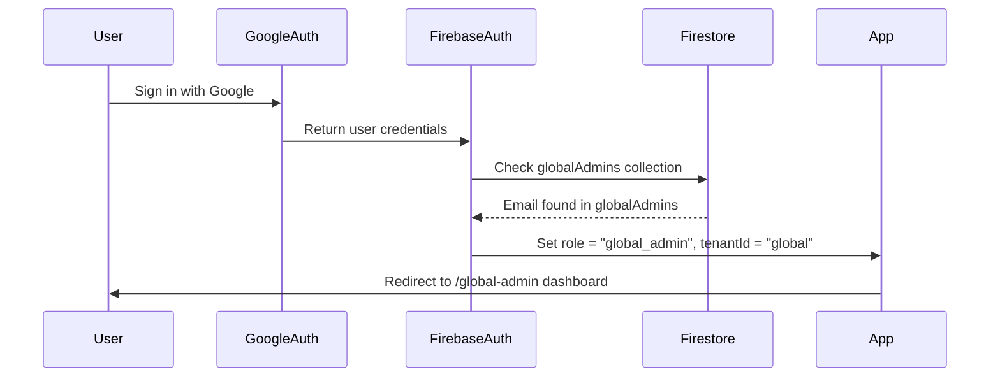
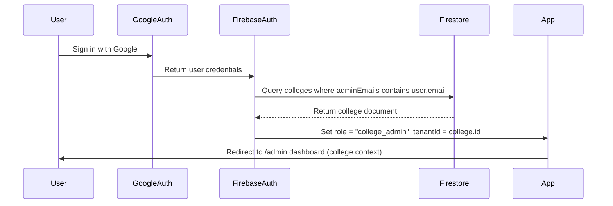
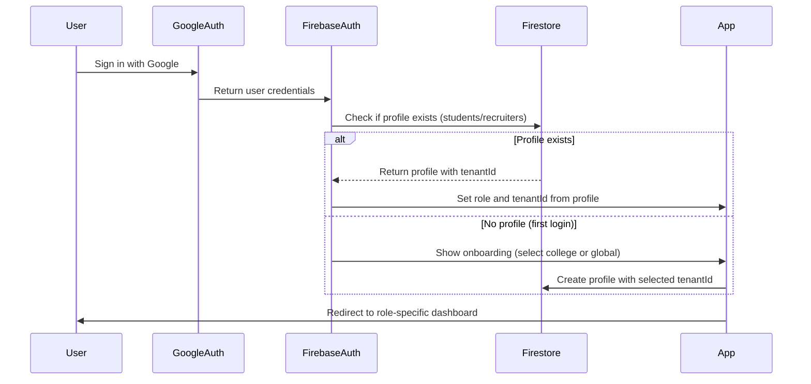

# 🏢 Multi-Tenant Architecture Documentation

> **Feature:** Global Admin & College-Level Multi-Tenancy  
> **Version:** 2.0  
> **Status:** Design Phase

---

## 📋 Table of Contents

1. [Overview](#-overview)
2. [User Roles & Hierarchy](#-user-roles--hierarchy)
3. [Architecture Changes](#-architecture-changes)
4. [Data Isolation Strategy](#-data-isolation-strategy)
5. [Authentication Flow](#-authentication-flow)
6. [Database Schema](#-database-schema)
7. [Implementation Roadmap](#-implementation-roadmap)

---

## 🎯 Overview

### Business Requirements

Placecraft is evolving from a single-college platform to a **multi-tenant SaaS solution** that serves:
1. **Individual colleges** with their own placement ecosystems
2. **Global audience** (non-college students and recruiters)

### Key Principles

- **Same Application Structure:** The UI and features remain identical across tenants
- **Data Isolation:** College students see only college data; global students see only global data
- **Hierarchical Admin System:** Global admin manages colleges; college admins manage their institutions
- **Email-Based Access Control:** Admin access is pre-authorized via email verification

---

## 👥 User Roles & Hierarchy

### Role Structure

```
┌─────────────────────────────────────────┐
│         GLOBAL ADMIN (Super Admin)      │
│  - Create/manage colleges                │
│  - Assign college admins                 │
│  - Manage global students/recruiters     │
│  - Full system access                    │
└─────────────────────────────────────────┘
                    │
        ┌───────────┴───────────┐
        ▼                       ▼
┌──────────────────┐    ┌──────────────────┐
│  COLLEGE ADMIN   │    │  COLLEGE ADMIN   │
│  (College A)     │    │  (College B)     │
│  - Manage drives │    │  - Manage drives │
│  - View students │    │  - View students │
│  - College scope │    │  - College scope │
└──────────────────┘    └──────────────────┘
        │                       │
    ┌───┴───┐               ┌───┴───┐
    ▼       ▼               ▼       ▼
 Students  Recruiters    Students  Recruiters
 (College A)             (College B)

┌─────────────────────────────────────────┐
│         GLOBAL CONTEXT                   │
│  - Global students (no college)          │
│  - Global recruiters                     │
│  - Public job postings                   │
└─────────────────────────────────────────┘
```

### Role Definitions

| Role | Scope | Capabilities |
|------|-------|--------------|
| **Global Admin** | System-wide | Create colleges, assign college admins, manage global data, system configuration |
| **College Admin** | Single college | Manage students, drives, recruiters within their college (same as current admin) |
| **Student (College)** | Single college | Access college-specific drives and data only |
| **Student (Global)** | Global context | Access global/public drives only |
| **Recruiter (College)** | Single college | Post drives for specific college |
| **Recruiter (Global)** | Global context | Post drives for global audience |

---

## 🏗️ Architecture Changes

### Current Architecture (Single Tenant)

```
User → Firebase Auth → Role Check (constants.ts) → Single Database Context
```

### New Architecture (Multi-Tenant)

```
User → Firebase Auth → Tenant Resolution → Role & Scope Check → Tenant-Scoped Database Context
```

### Key Architectural Components

#### 1. Tenant Resolution Layer
- Determines user's tenant context (college ID or "global")
- Happens immediately after authentication
- Stored in user session/context

#### 2. Scope-Based Data Filtering
- All database queries filtered by `tenantId`
- Firestore security rules enforce tenant isolation
- No cross-tenant data leakage

#### 3. Admin Authorization System
- Global admin emails stored in Firestore (not hardcoded)
- College admin emails linked to college documents
- Pre-authorization before first login

---

## 🔒 Data Isolation Strategy

### Tenant Identification

Every data entity will have a `tenantId` field:

```typescript
tenantId: string  // Format: "college_{uuid}" or "global"
```

### Isolation Rules

| Entity | Tenant Scope | Visibility |
|--------|-------------|------------|
| **Students** | College or Global | Only within their tenant |
| **Recruiters** | College or Global | Only within their tenant |
| **Placement Drives** | College or Global | Only to students in same tenant |
| **Applications** | Inherits from Drive | Scoped to drive's tenant |
| **Colleges** | System-wide | Only global admins can manage |

### Cross-Tenant Scenarios

**Scenario:** Can a college student apply to global drives?
- **Answer:** No. Students are locked to their tenant context.
- **Rationale:** Maintains clear separation between college and public ecosystems.

**Scenario:** Can a global recruiter post to a college?
- **Answer:** No. Recruiters operate within their assigned tenant.
- **Exception:** Global admin can create drives in any tenant (for testing/support).

---

## 🔐 Authentication Flow

### 1. Global Admin Login Flow



### 2. College Admin Login Flow



### 3. Student/Recruiter Login Flow



### Authentication Decision Tree

```
User logs in with Google
    │
    ├─ Email in globalAdmins collection?
    │   └─ YES → Global Admin (tenantId: "global")
    │
    ├─ Email in any college.adminEmails array?
    │   └─ YES → College Admin (tenantId: college.id)
    │
    ├─ Profile exists in students/recruiters?
    │   └─ YES → Use existing role & tenantId
    │
    └─ No existing profile
        └─ Show onboarding → User selects college or global → Create profile
```

---

## 📊 Database Schema

### New Collections

#### 1. `colleges` Collection

```typescript
interface College {
  id: string;                    // Auto-generated UUID
  name: string;                  // "MIT College of Engineering"
  code: string;                  // "MIT-COE" (unique, URL-friendly)
  location: string;              // "Pune, Maharashtra"
  adminEmails: string[];         // ["admin1@college.edu", "admin2@college.edu"]
  settings: {
    allowStudentRegistration: boolean;  // Can students self-register?
    requireEmailDomain: string;         // "@college.edu" (optional)
    branding: {
      logo?: string;              // URL to college logo
      primaryColor?: string;      // Hex color
    };
  };
  status: "active" | "inactive" | "suspended";
  createdAt: Timestamp;
  updatedAt: Timestamp;
  createdBy: string;             // Global admin UID who created this
}
```

**Indexes:**
- `code` (unique)
- `status`
- `adminEmails` (array-contains)

---

#### 2. `globalAdmins` Collection

```typescript
interface GlobalAdmin {
  id: string;                    // Auto-generated
  email: string;                 // "superadmin@placecraft.com"
  uid?: string;                  // Firebase UID (set after first login)
  name?: string;                 // Display name
  addedAt: Timestamp;
  addedBy: string;               // UID of admin who added this email
  status: "active" | "revoked";
}
```

**Indexes:**
- `email` (unique)
- `uid`
- `status`

---

### Modified Collections

#### 3. `students` Collection (Modified)

```typescript
interface StudentProfile {
  // ... existing fields ...
  
  // NEW FIELDS
  tenantId: string;              // "college_{uuid}" or "global"
  tenantType: "college" | "global";
  collegeId?: string;            // Reference to college.id (if tenantType = "college")
  collegeName?: string;          // Denormalized for quick display
}
```

**New Indexes:**
- `tenantId`
- `tenantId` + `email`
- `tenantId` + `graduationYear`

---

#### 4. `recruiters` Collection (Modified)

```typescript
interface RecruiterProfile {
  // ... existing fields ...
  
  // NEW FIELDS
  tenantId: string;              // "college_{uuid}" or "global"
  tenantType: "college" | "global";
  collegeId?: string;            // Reference to college.id (if tenantType = "college")
}
```

**New Indexes:**
- `tenantId`
- `tenantId` + `verified`

---

#### 5. `drives` Collection (Modified)

```typescript
interface PlacementDrive {
  // ... existing fields ...
  
  // NEW FIELDS
  tenantId: string;              // "college_{uuid}" or "global"
  tenantType: "college" | "global";
  collegeId?: string;            // Reference to college.id (if tenantType = "college")
  visibility: "tenant" | "public";  // Future: allow cross-tenant visibility
}
```

**New Indexes:**
- `tenantId` + `status`
- `tenantId` + `createdAt`

---

#### 6. `applications` Collection (Modified)

```typescript
interface Application {
  // ... existing fields ...
  
  // NEW FIELDS
  tenantId: string;              // Inherited from drive
  tenantType: "college" | "global";
}
```

**New Indexes:**
- `tenantId` + `driveId`
- `tenantId` + `studentId`

---

## 🔐 Firestore Security Rules

### Tenant Isolation Rules

```javascript
// Helper function to check tenant access
function hasAccessToTenant(tenantId) {
  let user = request.auth;
  
  // Global admins can access any tenant
  if (isGlobalAdmin(user.token.email)) {
    return true;
  }
  
  // College admins can access their college
  if (isCollegeAdmin(user.token.email, tenantId)) {
    return true;
  }
  
  // Users can access their own tenant
  return user.token.tenantId == tenantId;
}

// Students collection
match /students/{studentId} {
  allow read: if hasAccessToTenant(resource.data.tenantId);
  allow create: if request.auth != null && 
                   request.resource.data.tenantId == request.auth.token.tenantId;
  allow update: if hasAccessToTenant(resource.data.tenantId);
}

// Drives collection
match /drives/{driveId} {
  allow read: if hasAccessToTenant(resource.data.tenantId);
  allow create: if hasAccessToTenant(request.resource.data.tenantId);
  allow update: if hasAccessToTenant(resource.data.tenantId);
}

// Colleges collection
match /colleges/{collegeId} {
  allow read: if request.auth != null;  // All authenticated users can read
  allow write: if isGlobalAdmin(request.auth.token.email);  // Only global admins
}

// Global admins collection
match /globalAdmins/{adminId} {
  allow read: if isGlobalAdmin(request.auth.token.email);
  allow write: if isGlobalAdmin(request.auth.token.email);
}
```

---

## 🛠️ Implementation Roadmap

### Phase 1: Database & Schema Setup (Week 1)

**Tasks:**
1. Create `colleges` collection with initial schema
2. Create `globalAdmins` collection
3. Add `tenantId`, `tenantType`, `collegeId` fields to existing collections
4. Create Firestore indexes for tenant-based queries
5. Update Firestore security rules for tenant isolation

**Deliverables:**
- Migration script to add `tenantId: "global"` to existing data
- Database schema validation tests

---

### Phase 2: Authentication System (Week 2)

**Tasks:**
1. Create tenant resolution service (`lib/firebase/tenant.ts`)
2. Update authentication flow to determine tenant context
3. Implement global admin email verification
4. Implement college admin email verification
5. Add tenant context to user session/token
6. Create admin authorization middleware

**Deliverables:**
- `getTenantContext(user)` function
- `isGlobalAdmin(email)` function
- `getCollegeForAdmin(email)` function
- Updated `useAuth()` hook with tenant context

---

### Phase 3: Global Admin Dashboard (Week 3)

**Tasks:**
1. Create `/global-admin` route and layout
2. Build college management UI:
   - Create new college form
   - Edit college details
   - View all colleges list
3. Build admin management UI:
   - Add college admin emails
   - Remove admin access
   - View admin list per college
4. Create global admin API routes
5. Implement college activation/deactivation

**Deliverables:**
- Global admin dashboard with full CRUD for colleges
- College admin email management interface

---

### Phase 4: Tenant-Aware Data Layer (Week 4)

**Tasks:**
1. Update all Firestore queries to include `tenantId` filter
2. Modify `createStudent()`, `createRecruiter()` to accept `tenantId`
3. Update `createDrive()` to include tenant context
4. Add tenant validation in API routes
5. Update all list/query functions with tenant scope

**Deliverables:**
- Tenant-scoped database functions
- API middleware for tenant validation
- Unit tests for data isolation

---

### Phase 5: UI Updates & Onboarding (Week 5)

**Tasks:**
1. Create college selection during student onboarding
2. Update login flow to handle multiple admin types
3. Add college branding support (logo, colors)
4. Update navigation based on tenant context
5. Add tenant indicator in UI (college name badge)

**Deliverables:**
- Updated onboarding flow with college selection
- Tenant-aware UI components
- College branding system

---

### Phase 6: Testing & Migration (Week 6)

**Tasks:**
1. Write integration tests for multi-tenant scenarios
2. Test data isolation between tenants
3. Migrate existing data to global tenant
4. Create sample college for testing
5. Performance testing with multiple tenants
6. Security audit of tenant isolation

**Deliverables:**
- Comprehensive test suite
- Migration scripts with rollback capability
- Security audit report

---

### Phase 7: Documentation & Deployment (Week 7)

**Tasks:**
1. Update API documentation
2. Create admin user guides
3. Update deployment configuration
4. Set up monitoring for tenant-specific metrics
5. Production deployment with feature flag

**Deliverables:**
- Complete documentation
- Deployment runbook
- Monitoring dashboards

---

## 📈 Success Metrics

### Technical Metrics
- **Data Isolation:** 100% - No cross-tenant data leakage
- **Query Performance:** < 500ms for tenant-scoped queries
- **Authentication:** < 2s for tenant resolution
- **Scalability:** Support 100+ colleges without performance degradation

### Business Metrics
- **College Onboarding:** < 5 minutes to create and configure new college
- **Admin Management:** < 1 minute to add/remove college admin
- **User Experience:** No visible difference in app performance across tenants

---

## 🚨 Critical Considerations

### Data Migration
- **Existing Data:** All current students, recruiters, drives will be assigned `tenantId: "global"`
- **Backward Compatibility:** Queries without `tenantId` will default to "global" during transition
- **Rollback Plan:** Keep backup before migration, ability to revert schema changes

### Performance
- **Index Strategy:** Composite indexes on `tenantId` + frequently queried fields
- **Query Optimization:** Always include `tenantId` in where clauses
- **Caching:** Tenant metadata cached in-memory to reduce Firestore reads

### Security
- **Token Claims:** Add `tenantId` to Firebase custom claims for server-side validation
- **API Validation:** Every API route must validate tenant access
- **Audit Logging:** Log all cross-tenant access attempts (should be zero)

### User Experience
- **Transparent Tenancy:** Users should not feel "locked in" to a tenant
- **Clear Context:** Always show which college/context user is in
- **Error Messages:** Clear messages when accessing wrong tenant data

---

## 📚 Related Documentation

- [Database Schema Details](./database-schema.md)
- [Authentication Flow](./authentication-flow.md)
- [Data Isolation Strategy](./data-isolation.md)
- [Implementation Guide](./implementation-guide.md)
- [Migration Guide](./migration-guide.md)

---

**Document Version:** 2.0  
**Last Updated:** January 2026  
**Status:** 📝 Design Phase
